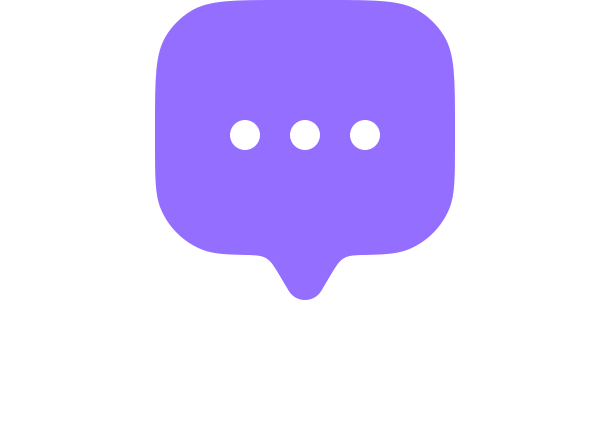

# Real-Time Chat Application

A modern, full-stack real-time chat application built with React and Node.js, featuring real-time messaging, user authentication, profile management, and image sharing capabilities.



## 🚀 Features

- **Real-time Messaging**: Instant messaging powered by Socket.IO
- **User Authentication**: Secure signup and login with JWT tokens
- **Profile Management**: Update profile information and profile pictures
- **Image Sharing**: Upload and share images in conversations
- **Online Status**: See who's currently online
- **Message Status**: Track message delivery and read status
- **Responsive Design**: Works seamlessly on desktop and mobile devices
- **Modern UI**: Clean and intuitive user interface with Tailwind CSS

## 🛠️ Technologies Used

### Frontend
- **React 19.1.1** - Modern JavaScript library for building user interfaces
- **React Router DOM 7.8.1** - Declarative routing for React applications
- **Socket.IO Client 4.8.1** - Real-time bidirectional event-based communication
- **Axios 1.11.0** - Promise-based HTTP client for API requests
- **Tailwind CSS 4.1.12** - Utility-first CSS framework for styling
- **React Hot Toast 2.6.0** - Beautiful toast notifications
- **Vite 7.1.2** - Fast build tool and development server

### Backend
- **Node.js** - JavaScript runtime environment
- **Express.js 5.1.0** - Fast, unopinionated web framework
- **Socket.IO 4.8.1** - Real-time communication library
- **MongoDB with Mongoose 8.17.2** - NoSQL database with object modeling
- **JSON Web Tokens 9.0.2** - Secure authentication
- **bcryptjs 3.0.2** - Password hashing library
- **Cloudinary 2.7.0** - Cloud-based image and video management
- **CORS 2.8.5** - Cross-origin resource sharing middleware

### Development Tools
- **ESLint** - JavaScript linting utility
- **Nodemon** - Auto-restart development server
- **dotenv** - Environment variables management

## 📁 Project Structure

```
chat-app/
├── client/                 # Frontend React application
│   ├── public/            # Static assets
│   ├── src/
│   │   ├── assets/        # Images and icons
│   │   ├── components/    # Reusable UI components
│   │   ├── context/       # React Context providers
│   │   ├── pages/         # Application pages
│   │   └── lib/           # Utility functions
│   ├── package.json
│   └── vite.config.js
└── server/                # Backend Node.js application
    ├── controllers/       # Route handlers
    ├── middleware/        # Authentication middleware
    ├── models/           # Database models
    ├── routes/           # API routes
    ├── lib/              # Database and utility functions
    ├── package.json
    └── server.js
```

## 🚀 Installation & Setup

### Prerequisites
- Node.js (v14 or higher)
- MongoDB database
- Cloudinary account (for image uploads)

### Environment Variables

Create a `.env` file in the server directory:

```env
PORT=5000
MONGODB_URI=your_mongodb_connection_string
JWT_SECRET=your_jwt_secret_key
CLOUDINARY_CLOUD_NAME=your_cloudinary_cloud_name
CLOUDINARY_API_KEY=your_cloudinary_api_key
CLOUDINARY_API_SECRET=your_cloudinary_api_secret
```

Create a `.env` file in the client directory:

```env
VITE_BACKEND_URL=http://localhost:5000
```

### Installation Steps

1. **Clone the repository**
   ```bash
   git clone https://github.com/Thanh14013/chat-app.git
   cd chat-app
   ```

2. **Install server dependencies**
   ```bash
   cd server
   npm install
   ```

3. **Install client dependencies**
   ```bash
   cd ../client
   npm install
   ```

4. **Start the development servers**

   **Terminal 1 (Backend):**
   ```bash
   cd server
   npm run server
   ```

   **Terminal 2 (Frontend):**
   ```bash
   cd client
   npm run dev
   ```

5. **Open your browser** and navigate to `http://localhost:5173`

## 📱 Usage

1. **Sign Up**: Create a new account with your email, full name, and password
2. **Login**: Sign in with your credentials
3. **Profile**: Update your profile picture and bio in the profile section
4. **Chat**: Select a user from the sidebar to start chatting
5. **Send Messages**: Type your message and press Enter or click the send button
6. **Share Images**: Click the gallery icon to upload and share images
7. **Real-time Updates**: See messages appear instantly and track online users

## 🔧 API Endpoints

### Authentication
- `POST /api/users/signup` - Register a new user
- `POST /api/users/login` - User login
- `GET /api/users/check` - Check authentication status
- `PUT /api/users/update-profile` - Update user profile

### Messages
- `GET /api/messages/users` - Get users for sidebar
- `GET /api/messages/:id` - Get messages with a specific user
- `POST /api/messages/send/:id` - Send message to a user
- `PUT /api/messages/mark/:id` - Mark message as seen

## 🎨 Key Components

### Frontend Components
- **AuthContext**: Manages user authentication state and Socket.IO connection
- **ChatContext**: Handles chat functionality and message management
- **ChatContainer**: Main chat interface for messaging
- **SideBar**: User list and navigation
- **RightSideBar**: Additional user information

### Backend Architecture
- **JWT Authentication**: Secure user authentication with tokens
- **Socket.IO Integration**: Real-time message delivery
- **MongoDB Models**: User and Message schemas with relationships
- **Cloudinary Integration**: Image upload and management
- **Express Middleware**: Authentication and CORS handling

## 🌟 Advanced Features

- **Real-time Online Status**: Track user presence with Socket.IO
- **Message Read Status**: Mark messages as seen/unseen
- **Image Upload**: Seamless image sharing with Cloudinary
- **Responsive Design**: Optimized for all device sizes
- **Toast Notifications**: User-friendly feedback system
- **Protected Routes**: Secure navigation based on authentication

## 🚀 Deployment

The application can be deployed on platforms like:
- **Frontend**: Vercel, Netlify, or GitHub Pages
- **Backend**: Heroku, Railway, or DigitalOcean
- **Database**: MongoDB Atlas (cloud database)

## 🤝 Contributing

Contributions are welcome! Please feel free to submit a Pull Request.

## 📄 License

This project is licensed under the ISC License.

## 📞 Contact

For any inquiries or support, please contact [thanh14704@example.com]

---

⭐ **Star this repository if you found it helpful!**
